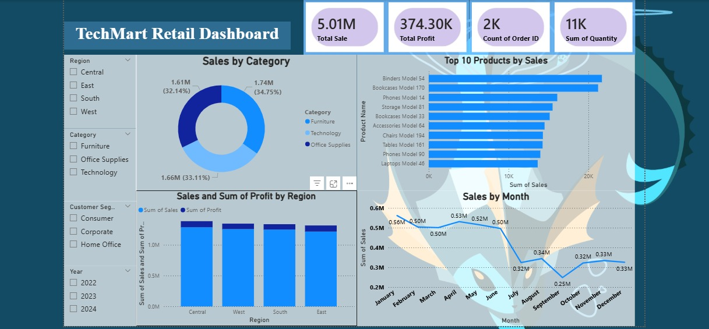

# 🛒 TechMart Retail Sales & Profit Analysis Dashboard

  

  
  
  
  

---

## 🧾 Project Overview

A comprehensive **7-page Power BI retail dashboard** built for **TechMart** analyzing total sales performance, profit margins, product rankings, regional comparisons, monthly trends, customer segments, and global sales distribution across multiple categories and years **(2022–2024).**

---

## 🎯 Objective

To provide TechMart's management team with a complete business intelligence solution that tracks retail KPIs, identifies top-performing products and regions, highlights underperforming periods, and supports strategic decisions in sales, inventory, and marketing planning.

---

## 📌 Key KPIs

| KPI | Value |
|-----|-------|
| 💰 Total Sale | **5.01M** |
| 📈 Total Profit | **374.30K** |
| 🧾 Count of Order ID | **2K** |
| 📦 Sum of Quantity | **11K** |
| 🏷️ Average Discount | **0.10 (10%)** |
| 📊 Profit Margin | **187.15** |

---

## 📊 Dashboard Pages (7 Total)

### 📄 Page 1 — KPIs
5 KPI summary cards: Total Sale, Total Qty Sold, Total Profit, Average Discount, Profit Margin.

---

### 📄 Page 2 — Main Dashboard

**🛍️ Sales by Category:**

| Category | Sales | Share |
|----------|-------|-------|
| 🪑 Furniture | **1.74M** | **34.75%** ← TOP |
| 🗂️ Office Supplies | **1.66M** | **33.11%** |
| 💻 Technology | **1.61M** | **32.14%** |

**🗺️ Sales & Profit by Region:**

| Rank | Region | Performance |
|------|--------|------------|
| 🥇 1st | **Central** | Highest Sales & Profit |
| 🥈 2nd | **West** | |
| 🥉 3rd | **South** | |
| 4th | **East** | Lowest |

**🏆 Top 10 Products by Sales:**

| Rank | Product |
|------|---------|
| 1 | **Binders Model 54** ← #1 |
| 2 | Bookcases Model 170 |
| 3 | Phones Model 14 |
| 4 | Storage Model 81 |
| 5 | Bookcases Model 33 |
| 6 | Accessories Model 64 |
| 7 | Chairs Model 194 |
| 8 | Tables Model 161 |
| 9 | Phones Model 90 |
| 10 | Laptops Model 46 |

**📅 Sales by Month:**

| Month | Sales | Note |
|-------|-------|------|
| January | **0.56M** | 🔴 Peak |
| February | 0.50M | |
| March | 0.50M | |
| April | **0.53M** | 2nd highest |
| May | 0.52M | |
| June | 0.50M | |
| July | 0.32M | ↓ Dip begins |
| August | 0.34M | |
| September | **0.25M** | 🔵 Lowest |
| October | 0.32M | ↑ Recovery |
| November | 0.33M | |
| December | 0.33M | |

---

### 📄 Page 3 — Composition
Detailed **Sales by Category** donut chart — Furniture 34.75%, Office Supplies 33.11%, Technology 32.14%.

---

### 📄 Page 4 — Comparison
- **Top 10 Products** horizontal bar chart (standalone detailed view)
- **Sales & Profit by Region** — Central clearly leads all 4 regions

---

### 📄 Page 5 — Trend
Monthly Sales line chart — full year view showing:
- **Strong H1** (Jan–Jun): 0.50M–0.56M range
- **Sharp mid-year dip** (Jul–Sep): drops to 0.25M
- **Partial recovery** (Oct–Dec): stabilizes at 0.32M–0.33M

---

### 📄 Page 6 — Global Map
**Bing Map** — Sales by Country (bubble map)
- Markets confirmed in: **North America, Europe, Africa**
- Largest bubbles in North America and Europe

---

### 📄 Page 7 — Business Insights Report

Key findings documented directly in the dashboard:
- ✅ **Central region** = highest selling and most profitable region
- ✅ **Furniture leads** all categories at **34.75%**
- ⚠️ **October falling behind** in Consumer & Home Office segments
- ⚠️ **June falling behind** in Corporate segment
- ✅ Binders Model 54 & Bookcases Model 170 lead product sales

---

## 💡 Key Business Insights

1. **Central region tops all metrics** — highest in both sales and profit across 4 regions.
2. **Furniture leads at 34.75%** — slightly ahead but all 3 categories are closely competitive.
3. **January is peak month (0.56M)** — likely driven by new year budgets and seasonal restocking.
4. **September is the weakest (0.25M)** — a **55% drop** from January, major mid-year dip.
5. **Binders Model 54 is #1 product** — office supplies drive volume at high frequency.
6. **10% average discount** applied consistently — review discount strategy to protect margins.
7. **East region underperforms** — potential opportunity for targeted campaigns and expansion.
8. **Corporate segment dips in June** — plan Q2 corporate promotions proactively.
9. **Consumer & Home Office weak in October** — targeted campaigns needed pre-holiday season.
10. **Technology at 32.14%** — smallest share despite higher unit values — untapped growth area.
11. **Global market presence** across 3 continents — strong foundation for international growth.
12. **H1 sales (3.11M) vs H2 sales (1.90M)** — severe second-half underperformance needs attention.

---

## 🔧 Power BI Features Used

- ✅ **7 Interactive Report Pages** — end-to-end retail analytics
- ✅ **DAX Measures** — KPI calculations, profit margin, totals
- ✅ **Power Query** — data transformation and cleansing
- ✅ **Bing Maps Integration** — global sales visualization
- ✅ **Slicers** — Region, Category, Customer Segment, Year
- ✅ **KPI Cards** — headline metrics at top of dashboard
- ✅ **Donut Chart** — category composition analysis
- ✅ **Horizontal Bar Chart** — top 10 product ranking
- ✅ **Clustered Bar Chart** — regional sales & profit comparison
- ✅ **Line Chart** — monthly sales trend analysis
- ✅ **Data Modeling** — multi-table relationships

---

## 🛠️ Tools & Technologies

---

## 📁 Project Deliverables

| File | Description |
|------|-------------|
| `TechMart_Dashboard.pbix` | Main 7-page Power BI report |
| `TechMart_Insights_Report.pdf` | Business insights & findings |
| `TechMart_Presentation.pptx` | PowerPoint presentation |
| `techmart_dashboard.jpg` | Dashboard screenshot |

---

## 👤 Author

**Syed Azhar Ali** — Data Analyst | MSc Computer Science

📍 Bhopal, MP, India &nbsp;|&nbsp; 📧 syedazharali199778@gmail.com

---

⭐ If you found this project useful, please give it a star!

